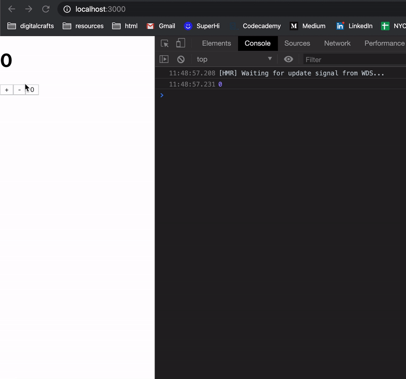

### Counter as a React-Redux Application 

### Node modules you need! 
- `npm install redux`
- `npm install react-dedux`

### Conventions (what files to create and put your code in)

### Redux 

- `actions.js` - actions constants and your action creator functions 
- `reducers.js`  (or a folder) - import your actions and define reducer functions 
- 'CounterApp.js` - define the store so that the React app can use it 

### React 

### "Dumb components" 
- `components/` - holds all your dumb components 
- They know nothing about Redux
- The accept props 
    - What do React Components do to props? 
        - show the props
        - use props as event handlers 

### "Smart Containers"
- `containers/`  - holds all your smart containers 
- They know all about Redux
    - have access to redux state
    - can call the store's dispatch
- They don't know about React 
    - they import your dumb components 
- They wire together your dumb components and redux's `state` and `dispatch`
    - define `mapStateToProps` function 
    - define `mapDispatchToProps` function 

